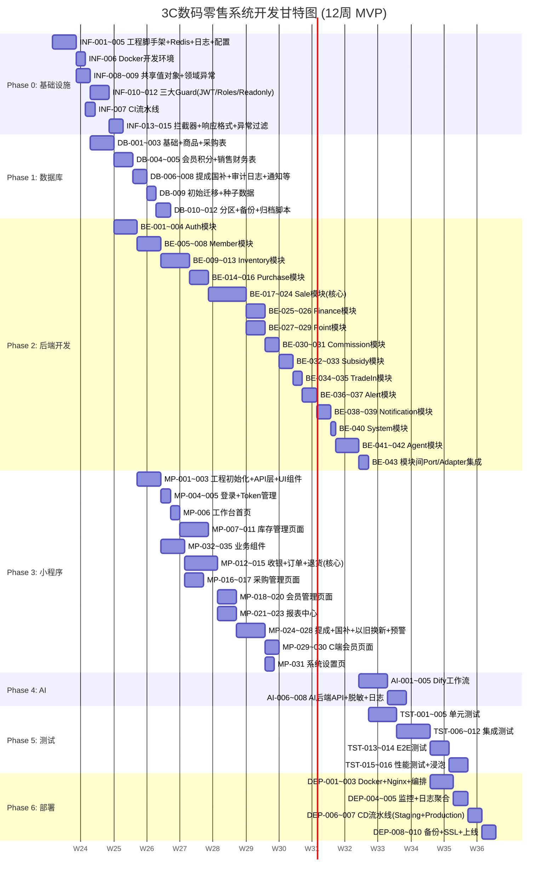

# TASK — 3C数码零售 ERP + CRM + AI 智能体系统 研发任务分解

> **版本**: V1.0 | **日期**: 2026-06-14 | **参考**: PROJECT_CONTEXT.md (SSOT)
>
> 任务总数：**125 个** | 预估总工时：**840 h** | 建议团队：**后端2人 + 前端1人 + 测试1人（兼职）**

---

## 目录

1. [角色定义](#1-角色定义)
2. [优先级说明](#2-优先级说明)
3. [Phase 0: 基础设施（15 任务）](#phase-0-基础设施)
4. [Phase 1: 数据库（12 任务）](#phase-1-数据库)
5. [Phase 2: 后端开发（43 任务）](#phase-2-后端开发)
6. [Phase 3: 小程序开发（31 任务）](#phase-3-小程序开发)
7. [Phase 4: AI 智能体（8 任务）](#phase-4-ai-智能体)
8. [Phase 5: 测试（16 任务）](#phase-5-测试)
9. [Phase 6: 部署与运维（10 任务）](#phase-6-部署与运维)
10. [甘特图开发计划](#甘特图开发计划)
11. [风险汇总](#风险汇总)
12. [里程碑清单](#里程碑清单)

---

## 1. 角色定义

| 角色 | 缩写 | 职责 |
|------|:----:|------|
| 后端开发 | BE | NestJS 模块、Prisma Schema、数据库脚本、API 开发 |
| 前端开发 | FE | 微信小程序页面、组件、API 对接 |
| 全栈开发 | FS | 可担任 BE 或 FE 角色 |
| 测试工程师 | QA | 测试用例编写、自动化测试、性能测试 |
| DevOps | OPS | CI/CD、Docker、监控、生产部署 |

---

## 2. 优先级说明

| 优先级 | 含义 | 说明 |
|:------:|------|------|
| P0 | 阻塞项 | 不完成则后续任务无法启动，必须最先完成 |
| P1 | 核心功能 | MVP 必需，直接影响主流程可用 |
| P2 | 重要功能 | 提升完整性，但不阻塞核心流程 |
| P3 | 增强项 | 体验优化、辅助功能，可延后 |

---

## Phase 0: 基础设施

> 目标：搭建开发环境、项目骨架、共享内核，为所有后续开发提供基础。

| ID | 模块 | 名称 | 描述 | 依赖 | 优先级 | 工时(h) | 角色 | 验收标准 | 风险 |
|:--:|------|------|------|------|:------:|:------:|:----:|----------|------|
| INF-001 | 工程 | NestJS 项目脚手架 | 使用 `@nestjs/cli` 初始化项目，配置 TypeScript strict mode、ESLint、Prettier、pnpm，生成 `nest-cli.json`、`tsconfig.build.json` | — | P0 | 4 | BE | `pnpm start:dev` 正常启动，输出 Hello World | 无 |
| INF-002 | 工程 | Prisma 初始化与连接 | 安装 Prisma 5.x，配置 `DATABASE_URL`，创建 `prisma/schema.prisma`（仅 datasource + generator），验证 `prisma db pull` 可连接空库 | INF-001 | P0 | 3 | BE | `prisma generate` 成功，PrismaService 注入正常 | MySQL 版本兼容性 |
| INF-003 | 工程 | Redis 集成 | 安装 ioredis，封装 `RedisService`（get/set/del/keys/exists），`RedisHealthIndicator`，配置连接池 | INF-001 | P0 | 3 | BE | 读写缓存正常，健康检查返回 connected | Redis 服务不可用 |
| INF-004 | 工程 | Pino 日志系统 | 安装 `nestjs-pino`，配置 JSON 格式输出 stdout，包含 traceId 自动注入，`redact` 脱敏 Authorization header | INF-001 | P0 | 2 | BE | 请求日志含 traceId/module/action/duration_ms | 日志量过大影响性能（通过 log level 控制） |
| INF-005 | 工程 | 环境配置管理 | 使用 `@nestjs/config` + Zod 校验环境变量（DB/REDIS/JWT/DIFY/SMS/COS 全部必需变量），缺失时拒绝启动并明确提示 | INF-001 | P0 | 3 | BE | 缺失任一必需变量时应用拒绝启动并打印明确错误 | 开发/生产环境变量不一致 |
| INF-006 | 工程 | Docker 开发环境 | 编写 `docker-compose.yml`（MySQL 8 + Redis 7），`Dockerfile.dev`（含热重载），`.env.example`，`docker-compose up -d`一键启动 | INF-001 | P0 | 4 | OPS | `docker compose up -d` 后 NestJS + MySQL + Redis 全部可访问 | Docker Desktop 版本兼容 |
| INF-007 | 工程 | GitHub Actions CI | 编写 `.github/workflows/ci.yml`：lint（ESLint）→ type-check（tsc）→ unit-test（Jest）→ build 四阶段流水线 | INF-001 | P1 | 4 | OPS | PR 自动触发 CI，失败则阻止合并 | CI runner 性能不足导致超时 |
| INF-008 | Shared | 共享值对象 | 实现 `Money`（Decimal 运算/格式化）、`Phone`（11位校验/脱敏）、`IMEI`（15位校验/脱敏）、`OrderNo`（生成规则）四个值对象 | INF-001 | P0 | 6 | BE | 每个 VO 含单元测试，非法值抛 DomainException | IMEI 校验规则变更（15位→未来可能扩展） |
| INF-009 | Shared | 共享领域异常 | 实现 `DomainException` 基类 + `BusinessRuleViolationException`、`ConcurrencyConflictException`、`InsufficientStockException`、`InvalidStateTransitionException` | INF-008 | P0 | 3 | BE | 异常正确映射到 HTTP 状态码（409/422/500） | 异常粒度不够导致调试困难 |
| INF-010 | Shared | JWT Auth Guard | 实现 `JwtAuthGuard`：验证签名+有效期→查Redis黑名单→解析payload→注入 `req.user`，与 `@Public()` 装饰器配合 | INF-005, INF-003 | P0 | 5 | BE | 无效Token→401，黑名单Token→40101，有效Token→放行 | JWT_SECRET 泄露 |
| INF-011 | Shared | Roles Guard | 实现 `RolesGuard`：读取 `@Permissions('write:sale')` 装饰器 → 比对 JWT payload 中 permissions 数组 → 无权限返回 40301 | INF-010 | P0 | 4 | BE | 无权限用户调用受保护接口返回 40301 | 权限粒度划分不当导致过度限制 |
| INF-012 | Shared | Readonly Guard（AI安全） | 实现 `ReadonlyGuard`：校验 `access_level === 'ai_readonly'` → 强制 HTTP method = GET → 非 GET 返回 40302 | INF-010 | P0 | 3 | BE | AI Token 调用 POST/PUT/DELETE 返回 40302，"AI只读Token不可执行写操作" | Guard 顺序错误导致绕过 |
| INF-013 | Shared | 日志拦截器 | 实现 `LoggingInterceptor`：记录请求 method/url/params/响应码/duration_ms，自动注入 traceId | INF-004 | P1 | 2 | BE | 每条请求日志含完整 trace 信息 | 大请求体导致日志膨胀 |
| INF-014 | Shared | 数据脱敏拦截器 | 实现 `MaskDataInterceptor`：响应中自动脱敏 phone（138****5678）/ IMEI（356789****12345）/ cost（不返回） | INF-008 | P1 | 4 | BE | 含 phone/IMEI/cost 字段的响应自动脱敏 | 误脱敏合法字段（白名单机制避免） |
| INF-015 | Shared | 统一响应 + 异常过滤 | 实现 `TransformInterceptor`（包装 `{code,message,data,requestId,timestamp}`）+ `HttpExceptionFilter`（所有异常统一格式） | INF-004 | P0 | 3 | BE | 所有API响应格式一致，异常信息不含敏感堆栈 | 异常信息泄露内部结构 |

---

## Phase 1: 数据库

> 目标：完成 Prisma Schema 全部 30 张表、初始迁移、种子数据、分区脚本、备份脚本。

| ID | 模块 | 名称 | 描述 | 依赖 | 优先级 | 工时(h) | 角色 | 验收标准 | 风险 |
|:--:|------|------|------|------|:------:|:------:|:----:|----------|------|
| DB-001 | Schema | 基础架构表（4张） | 编写 `shop`, `sys_user`, `sys_role`, `sys_user_role` 的 Prisma Model，含 UK/FK/索引/软删除/审计字段 | INF-002 | P0 | 4 | BE | `prisma db push` 成功建表，`@@index` 覆盖所有查询条件 | shop_id 外键约束影响 sys_user 删除 |
| DB-002 | Schema | 商品与库存表（4张） | 编写 `product`, `product_sku`, `imei_stock`, `stock_ledger` 的 Prisma Model，含 `imei_stock.version` 乐观锁字段 + `stock_ledger` INSERT ONLY 注释 | DB-001 | P0 | 5 | BE | `imei_stock.uk_imei` 唯一约束生效，`stock_ledger` 无 UPDATE 接口 | IMEI 唯一约束在大批量入库时的性能 |
| DB-003 | Schema | 采购表（2张） | 编写 `purchase_order`, `purchase_item` 的 Prisma Model，含软删除 + 审核状态机 | DB-001 | P0 | 3 | BE | `purchase_order.order_no` UK 生效，外键关联 product_sku | — |
| DB-004 | Schema | 会员与积分表（3张） | 编写 `member`, `member_referral`, `point_ledger` 的 Prisma Model，含 `member.total_points_version` 乐观锁 + `point_ledger` INSERT ONLY + 分区表标记 | DB-001 | P0 | 4 | BE | `member.phone` UK 生效，`member_referral.uk(referrer_id,referee_id)` 生效 | point_ledger 500万行分区策略 |
| DB-005 | Schema | 销售与财务表（4张） | 编写 `sale_order`, `sale_item`, `payment_flow`, `return_order` 的 Prisma Model，含软删除 + 财务字段 INSERT ONLY + 退款字段 | DB-001 | P0 | 5 | BE | `sale_order.order_no` UK，`return_order.return_no` UK，`payment_flow` 含 refund_amount/payment_type | 销售表与退货表的外键环形依赖 |
| DB-006 | Schema | 提成与国补表（2张） | 编写 `commission_rule`, `commission_ledger`, `national_subsidy` 的 Prisma Model，含状态机 + UK 约束 | DB-001 | P1 | 3 | BE | `national_subsidy.uk(order_no)` 生效，`commission_ledger.uk(salesperson_id,settlement_period,order_no)` 生效 | — |
| DB-007 | Schema | 审计与日志表（3张） | 编写 `audit_log`, `system_log`, `ai_chat_log` 的 Prisma Model，`system_log` 含 JSON 字段 detail_json，分区表标记 | DB-001 | P1 | 3 | BE | JSON 字段正确映射为 Prisma Json 类型，分区键为 created_at | JSON 查询性能（建立虚拟列索引） |
| DB-008 | Schema | 通知/预警/盘点/其他（8张） | 编写 `notification_outbox`, `sms_log`, `daily_reconcile`, `points_expire_log`, `alert_rule`, `alert_log`, `stock_check`, `stock_check_item`, `trade_in_order` 的 Prisma Model | DB-001 | P1 | 4 | BE | 全部表建表成功，`daily_reconcile.uk(shop_id,reconcile_date,check_type)` 生效 | trade_in_order 字段可能随业务扩展 |
| DB-009 | Migration | 初始迁移 + 种子数据 | `prisma migrate dev --name init` 生成迁移 SQL，编写种子脚本（默认门店、6种角色、admin用户、默认预警规则） | DB-001~008 | P0 | 4 | BE | `prisma migrate deploy` 在生产空库执行成功，种子数据正确插入 | 迁移 SQL 含 DROP TABLE（Prisma shadow database 避免） |
| DB-010 | Scripts | 分区管理脚本 | 编写 5 张分区表的 `CREATE PARTITION` 脚本（每半年一个分区，提前创建未来 1 年分区），归档旧分区脚本 | DB-004,DB-005,DB-007 | P1 | 4 | BE | 执行后 `SHOW CREATE TABLE` 确认分区已创建，归档脚本不丢失数据 | 忘记提前创建新分区导致 INSERT 失败 |
| DB-011 | Scripts | 数据库备份恢复脚本 | 全量备份（`mysqldump --single-transaction`）+ binlog 增量备份 + COS 异地同步 + 恢复脚本 + 恢复验证 | INF-006 | P1 | 4 | OPS | 备份压缩包可成功恢复到全新 MySQL 实例，COS 文件存在 | 备份期间锁表影响业务（--single-transaction 避免） |
| DB-012 | Scripts | 数据归档脚本 | 编写冷数据归档脚本：`sale_order`/`sale_item`/`point_ledger` 超 1 年数据 → COS parquet 格式归档 → 删除原表数据 | DB-010 | P2 | 4 | BE | 归档后查询不报错，归档文件可读回 | 归档条件不准确误归档热数据 |

---

## Phase 2: 后端开发

> 目标：按 DDD 四层架构完成全部 14 个业务模块。

### 2.1 Auth — 认证授权模块

| ID | 模块 | 名称 | 描述 | 依赖 | 优先级 | 工时(h) | 角色 | 验收标准 | 风险 |
|:--:|------|------|------|------|:------:|:------:|:----:|----------|------|
| BE-001 | Auth | 领域层 | 实现 `User` 实体、`Role` 实体、`Password` 值对象（bcrypt cost=12）、`Token` 值对象、`TokenBlacklist` 领域服务接口、`IUserRepository` 接口 | INF-008, DB-001 | P0 | 5 | BE | 实体包含所有业务字段，`Password.verify()` 使用 bcrypt.compare | bcrypt 加密耗时影响登录响应（异步处理） |
| BE-002 | Auth | 应用层 | 实现 `LoginService`（手机号+验证码/密码双模式）、`TokenService`（JWT签发+RefreshToken轮换）、`LogoutService`（Token入Redis黑名单） | BE-001, INF-010 | P0 | 6 | BE | 登录成功返回 access_token + refresh_token，logout 后 Token 不可用 | RefreshToken 轮换时并发导致旧Token误判 |
| BE-003 | Auth | 接口层 | 实现 `AuthController`（POST login/send-sms-code/refresh/logout, GET me），Swagger 装饰器完整，DTO 验证 | BE-002, INF-015 | P0 | 4 | BE | Swagger UI 可见 4 个接口，请求参数校验生效 | 短信验证码接口被滥刷（加图形验证码+限流） |
| BE-004 | Auth | Token 黑名单 | 实现 Redis 黑名单 key=`blacklist:<jti>`，TTL=Token剩余有效期，`JwtStrategy.validate()` 中优先查黑名单 | BE-002, INF-003 | P0 | 3 | BE | 黑名单中 Token 调用接口返回 40102 | Redis 故障导致所有用户被踢（降级策略：Redis不可用时放行） |

### 2.2 Member — 会员模块

| ID | 模块 | 名称 | 描述 | 依赖 | 优先级 | 工时(h) | 角色 | 验收标准 | 风险 |
|:--:|------|------|------|------|:------:|:------:|:----:|----------|------|
| BE-005 | Member | 领域层 | 实现 `Member` 实体（软删除）、`Referral` 实体、`MemberPhone` 值对象、`MemberRegisteredEvent` 领域事件、`IMemberRepository` | INF-008, DB-004 | P0 | 4 | BE | 实体含 total_points + total_points_version 乐观锁字段 | 手机号修改后推荐关系追溯困难 |
| BE-006 | Member | 应用层 | 实现 `RegisterService`（手机号注册+推荐码绑定）、`MemberQueryService`（列表/详情/搜索/导出）、`MemberEditService`、`SoftDeleteService`、`ReferralService`（推荐关系+老带新奖励触发） | BE-005 | P0 | 8 | BE | 注册写入 member+referral+point_ledger（+200积分），重复手机号拒绝 | 老带新奖励触发时机（需等首单消费完成） |
| BE-007 | Member | 接口层 | 实现 `MemberController`（B端：POST /members, GET /members, GET /members/:id, PUT /members/:id, DELETE /members/:id）和 `CMemberController`（C端：GET /c/members/me, GET /c/members/orders, GET /c/members/points） | BE-006, INF-015 | P0 | 5 | BE | B端 13 接口 + C端 5 接口 Swagger 可见，C端仅能访问自己数据 | C端越权访问其他会员数据（openid校验） |
| BE-008 | Member | 推荐奖励逻辑 | 实现推荐奖励：被推荐人首单消费后 → 推荐人+200积分 + 被推荐人+200积分 → 写入 point_ledger（change_type=referral） | BE-006, BE-021 | P1 | 4 | BE | 单元测试覆盖：首次消费触发、非首次不触发、双方积分到账 | 并发消费导致奖励重复发放（幂等键防重） |

### 2.3 Inventory — 库存模块

| ID | 模块 | 名称 | 描述 | 依赖 | 优先级 | 工时(h) | 角色 | 验收标准 | 风险 |
|:--:|------|------|------|------|:------:|:------:|:----:|----------|------|
| BE-009 | Inventory | 领域层 - Product | 实现 `Product` 实体、`ProductSku` 实体（软删除）、`Barcode` 值对象、`RetailPrice` 值对象、`IProductRepository` | INF-008, DB-002 | P0 | 4 | BE | `Product.uk(brand,model)` 和 `ProductSku.uk(product_id,color,spec)` 通过 Prisma @@unique 实现 | SKU 规格属性动态扩展需求 |
| BE-010 | Inventory | 领域层 - IMEI Stock | 实现 `ImeiStock` 实体（含 version 乐观锁）、`StockStatus` 状态机（pending_audit→in_stock→sold/returned/frozen）、`IImeiStockRepository` | INF-008, INF-009, DB-002 | P0 | 6 | BE | 状态转换合法路径放行、非法路径抛 InvalidStateTransitionException | 状态机遗漏"已售→退货中→退货审核"路径 |
| BE-011 | Inventory | 领域层 - Stock Ledger | 实现 `StockLedger` 实体（INSERT ONLY，含 change_type/inbound/outbound/return/check_adjust）、`StockLedgerService`（记录每次库存变动） | BE-010 | P0 | 3 | BE | 每次库存操作自动写入 stock_ledger，无 UPDATE/DELETE 暴露 | 存量数据迁移时 ledger 缺失 |
| BE-012 | Inventory | 应用层 | 实现 `ProductCrudService`、`StockQueryService`（多维筛选：shop_id/sku_id/status/IMEI模糊搜索/分页）、`ImeiTraceService`（全生命周期：入库→在库→销售→退货）、`ExportService`（Excel导出）、`LowStockCheckService` | BE-009, BE-010, BE-011 | P0 | 8 | BE | 库存列表查询涵盖所有筛选条件，IMEI 追溯返回完整状态变更时间线 | 大量 IMEI 模糊搜索性能（限制结果集+索引优化） |
| BE-013 | Inventory | 接口层 | 实现 `ProductController`（CRUD）、`StockController`（GET list/:imei/export/summary/low-stock/slow-moving/categories）、`StockCheckController`（create/scan/commit） | BE-012, INF-015 | P0 | 5 | BE | 16 接口 Swagger 可见，Excel 导出文件可下载 | 导出超大数据集 OOM（流式写入+分页导出） |

### 2.4 Purchase — 采购模块

| ID | 模块 | 名称 | 描述 | 依赖 | 优先级 | 工时(h) | 角色 | 验收标准 | 风险 |
|:--:|------|------|------|------|:------:|:------:|:----:|----------|------|
| BE-014 | Purchase | 领域层 | 实现 `PurchaseOrder` 实体（软删除）、`PurchaseItem` 实体、`PurchaseNo` 值对象、`PurchaseSubmittedEvent`、`PurchaseAuditedEvent`、`IPurchaseOrderRepository` | INF-008, DB-003 | P0 | 4 | BE | 实体状态机 pending→approved→received→cancelled 正确 | — |
| BE-015 | Purchase | 应用层 | 实现 `ScanInboundService`（扫码入库：校验 IMEI 不存在→创建 purchase_order+item→写入 imei_stock(status=pending_audit)→写入 stock_ledger）、`AuditInboundService`（审核通过：imei_stock status→in_stock+写入 audit_log；驳回：status→frozen+写入 audit_log）、`PurchaseQueryService` | BE-014, BE-010, BE-011 | P0 | 8 | BE | 入库申请后 IMEI 状态=pending_audit，审核通过后=in_stock，审核驳回后=frozen | 并发入库同一 IMEI（UK 约束 + 乐观锁双重防重） |
| BE-016 | Purchase | 接口层 | 实现 `PurchaseController`（POST inbound/scan, GET inbound/audit-list, POST inbound/audit/:id, POST purchase-orders, GET purchase-orders, GET purchase-orders/:id, PUT purchase-orders/:id, POST purchase-orders/:id/receive） | BE-015, INF-015 | P0 | 5 | BE | 10 接口 Swagger 可见，审核接口含审计日志自动记录 | — |

### 2.5 Sale — 销售模块（核心）

| ID | 模块 | 名称 | 描述 | 依赖 | 优先级 | 工时(h) | 角色 | 验收标准 | 风险 |
|:--:|------|------|------|------|:------:|:------:|:----:|----------|------|
| BE-017 | Sale | 领域层 | 实现 `SaleOrder` 实体（软删除, 财务字段 INSERT ONLY）、`SaleItem` 实体、`ReturnOrder` 实体（软删除, 含 audit_status）、`OrderNo`/`ReturnNo` 值对象、`ISaleOrderRepository`/`IReturnOrderRepository` | INF-008, DB-005 | P0 | 5 | BE | 实体覆盖全字段，`sale_order` 财务字段无 UPDATE 方法 | — |
| BE-018 | Sale | 领域服务 - 毛利计算 | 实现 `ProfitCalculator`：gross_profit = sale_item.sale_price - sale_item.cost_price_snapshot - sale_item.subsidy_income - sale_item.commission | BE-017 | P0 | 3 | BE | 单元测试覆盖：正毛利/零毛利/负毛利三种场景，Decimal 精度到分 | 国补/提成变动后毛利未同步更新（历史订单固化，不更新） |
| BE-019 | Sale | 领域服务 - 积分计算 | 实现 `PointsCalculator`：earned_points = floor(actual_paid)，100积分=1元抵现，≥3000积分可换购 | BE-017 | P1 | 3 | BE | unit test: 消费199元=199积分，消费1元=1积分，不足1元不计 | 积分规则变更（规则配置化减轻） |
| BE-020 | Sale | 领域服务 - 提成预估 | 实现 `CommissionEstimator`：遍历 commission_rule（按 priority 排序）→ 匹配 brand/model/min_price/max_price → 计算预估提成（fixed/percentage/tiered） | BE-017, DB-006 | P1 | 4 | BE | 单元测试：匹配固定金额/百分比/阶梯三种规则，未匹配返回0 | 规则冲突（同品牌多规则→priority 字段解决） |
| BE-021 | Sale | 应用层 - 扫码出库（核心事务） | 实现 `ScanOutboundService`：这是系统最复杂的事务（7-8表，单数据库 REPEATABLE READ）：① 校验 IMEI 在库（optimistic lock）② UPDATE imei_stock（status→sold, version+1）③ INSERT sale_order ④ INSERT sale_item(s) ⑤ INSERT point_ledger（积分获取）⑥ UPDATE member（total_points+version）⑦ INSERT notification_outbox ⑧ INSERT stock_ledger ⑨ INSERT commission_ledger（预估）⑩ INSERT national_subsidy（如有） | BE-017, BE-018, BE-019, BE-020, BE-010, BE-011 | P0 | 12 | BE | 🔥 同IMEI 100并发请求→仅1成功99失败（单元测试验证）；任一步骤失败全部回滚；成功后所有表数据一致 | 事务超时（优化SQL+拆分非关键路径）、乐观锁冲突处理不当导致脏数据 |
| BE-022 | Sale | 应用层 - 收款/订单/软删除 | 实现 `CreatePaymentService`（记录收款+更新 payment_flow）、`OrderQueryService`（列表/详情/导出）、`SoftDeleteOrderService`（仅标记 deleted_at，不修改财务字段） | BE-021 | P0 | 6 | BE | 收款后 payment_flow.reconcile_status=pending；订单删除后 GET 不返回但数据库记录存在 | 误删后恢复困难（deleted_at IS NULL 过滤，列表不可见） |
| BE-023 | Sale | 应用层 - 退货 | 实现 `ReturnSubmitService`（创建 return_order+更新 sale_order.return_status+INSERT stock_ledger）、`ReturnAuditService`（通过：UPDATE imei_stock→in_stock+INSERT point_ledger 冲正+UPDATE commission_ledger 追回+INSERT payment_flow 退款+UPDATE national_subsidy 追回；驳回：IMEI 保持 sold 状态） | BE-022, BE-010, BE-011 | P0 | 10 | BE | 退货审核通过后 IMEI 回到 in_stock，积分冲正、提成追回、国补追回全部执行 | 部分追回失败（积分冲正成功但提成追回失败→Saga补偿，当前用REPEATABLE READ事务） |
| BE-024 | Sale | 接口层 | 实现 `SaleController`（16接口）和 `ReturnController`（6接口），含 Swagger + DTO 验证 + 幂等装饰器 | BE-021, BE-022, BE-023, INF-015 | P0 | 6 | BE | 22 接口 Swagger 可见，出库接口带 `X-Idempotency-Key` 防重 | — |

### 2.6 Finance — 财务模块

| ID | 模块 | 名称 | 描述 | 依赖 | 优先级 | 工时(h) | 角色 | 验收标准 | 风险 |
|:--:|------|------|------|------|:------:|:------:|:----:|----------|------|
| BE-025 | Finance | 领域层 + 应用层 | 实现 `PaymentFlow` 实体、`DailyReconcile` 实体、`GrossProfitService`（今日/本周/本月毛利汇总）、`PaymentFlowQueryService`（流水列表/详情）、`ReconcileExecutor`（4种对账：stock_vs_order/points_vs_ledger/payment_vs_order/subsidy_vs_sales） | DB-005 | P1 | 8 | BE | 毛利计算偏差=0（与销售单固化毛利比对），对账 diff=0 则 status=pass | 对账 diff 产生后无告警→写入 alert_log 联动 |
| BE-026 | Finance | 接口层 | 实现 `FinanceController`（GET gross-profit/payment-flow/daily-reconcile/cash-flow/daily-summary, POST daily-reconcile/execute） | BE-025, INF-015 | P1 | 4 | BE | 8 接口 Swagger 可见，毛利汇总含销售额/成本/国补/提成/毛利/订单数 | 大量订单时毛利汇总性能（物化视图或 Redis 预计算） |

### 2.7 Point — 积分模块

| ID | 模块 | 名称 | 描述 | 依赖 | 优先级 | 工时(h) | 角色 | 验收标准 | 风险 |
|:--:|------|------|------|------|:------:|:------:|:----:|----------|------|
| BE-027 | Point | 领域层 | 实现 `PointLedger` 实体（INSERT ONLY，change_type: earn/redeem/expire/referral/manual_adjust）、`PointAmount` 值对象、`FifoConsumerService`（FIFO 积分消耗算法：按 expires_at ASC 依次扣减）、`ExpireCalculatorService`（次年12月31日过期计算）、`IPointLedgerRepository` | INF-008, DB-004 | P0 | 8 | BE | FIFO 算法单元测试：3笔积分(100/200/300，不同过期时间)→消耗250→从最早开始扣。年度过期计算正确 | FIFO 扣减并发导致 total_points 错乱（SELECT FOR UPDATE + version） |
| BE-028 | Point | 应用层 | 实现 `PointEarnService`（消费获取积分）、`PointRedeemService`（积分抵现/换购）、`PointExpireService`（批量过期：按member分批+SELECT FOR UPDATE+过期金额累加+UPDATE total_points+写入 points_expire_log+notification_outbox）、`ManualAdjustService`（手动调整：负数冲正） | BE-027, BE-006 | P0 | 8 | BE | 积分获取/抵现后 member.total_points 正确，过期批次处理不回滚已提交批次 | 过期任务执行一半中断（分批提交+重入幂等） |
| BE-029 | Point | 接口层 | 实现 `PointController`（B端：9接口）和 `CPointController`（C端：查积分流水） | BE-028, INF-015 | P0 | 4 | BE | 9+ 接口 Swagger 可见，C端仅看到自己的积分 | — |

### 2.8 Commission — 提成模块

| ID | 模块 | 名称 | 描述 | 依赖 | 优先级 | 工时(h) | 角色 | 验收标准 | 风险 |
|:--:|------|------|------|------|:------:|:------:|:----:|----------|------|
| BE-030 | Commission | 领域层 + 应用层 | 实现 `CommissionRule` 实体（fixed/percentage/tiered三种类型）、`CommissionLedger` 实体、`RuleMatcherService`（按 priority 匹配规则）、`RuleCrudService`、`SettlementService`（月度结算：estimated→confirmed→paid）、`PerformanceService`（员工业绩汇总） | DB-006 | P1 | 8 | BE | 规则匹配正确（价格区间+品牌/型号+优先级），结算流程完整 | 月中新增规则导致已售订单提成变更（规则加生效时间字段） |
| BE-031 | Commission | 接口层 | 实现 `CommissionController`（10接口：rules CRUD, performance list/detail, ledger, settlement create/list/confirm） | BE-030, INF-015 | P1 | 4 | BE | 10 接口 Swagger 可见，结算确认后不可撤销 | — |

### 2.9 Subsidy — 国补模块

| ID | 模块 | 名称 | 描述 | 依赖 | 优先级 | 工时(h) | 角色 | 验收标准 | 风险 |
|:--:|------|------|------|------|:------:|:------:|:----:|----------|------|
| BE-032 | Subsidy | 领域层 + 应用层 | 实现 `NationalSubsidy` 实体（状态机：pending_submit→submitted→under_review→approved/rejected→disbursed→recalled）、`SubsidyApplyService`、`SubsidyAuditService`（含审批/驳回）、`DisburseService`（拨付）、`RecallService`（追回，关联退货） | DB-006 | P1 | 8 | BE | 状态机完整，拨付后状态=disbursed，退货触发追回后状态=recalled | 国补政策变更导致审批流改（规则配置化减轻） |
| BE-033 | Subsidy | 接口层 | 实现 `SubsidyController`（10接口：records CRUD, submit, approve, reject, disburse, recall, summary） | BE-032, INF-015 | P1 | 4 | BE | 10 接口 Swagger 可见，国补申请与销售订单IMEI关联 | — |

### 2.10 TradeIn — 以旧换新模块

| ID | 模块 | 名称 | 描述 | 依赖 | 优先级 | 工时(h) | 角色 | 验收标准 | 风险 |
|:--:|------|------|------|------|:------:|:------:|:----:|----------|------|
| BE-034 | TradeIn | 领域层 + 应用层 | 实现 `TradeInOrder` 实体、`AppraisalValue` 值对象、`TradeInService`（估价录入→创建以旧换新订单→关联销售订单→旧机抵扣金额） | DB-008 | P2 | 6 | BE | 以旧换新订单与销售订单关联，actual_deduction ≤ approved_value | 旧机估价与实际市场价偏差大 |
| BE-035 | TradeIn | 接口层 | 实现 `TradeInController`（6接口：appraisal, orders CRUD, summary） | BE-034, INF-015 | P2 | 3 | BE | 6 接口 Swagger 可见 | — |

### 2.11 Alert — 预警模块

| ID | 模块 | 名称 | 描述 | 依赖 | 优先级 | 工时(h) | 角色 | 验收标准 | 风险 |
|:--:|------|------|------|------|:------:|:------:|:----:|----------|------|
| BE-036 | Alert | 领域层 + 应用层 | 实现 `AlertRule` 实体（4种类型：low_stock/slow_moving/price_anomaly/negative_profit）、`AlertLog` 实体（3级：urgent/warning/info）、`AlertEvaluatorService`（定时评估规则：库存低于阈值/30天无销售/售价低于成本/负毛利）、冷却机制（cooldown_minutes 内不重复告警） | DB-008 | P2 | 6 | BE | 库存低于阈值→触发告警→写入 alert_log+发送 notification_outbox，冷却期内不重复 | 频繁触发导致告警风暴（冷却机制+聚合通知） |
| BE-037 | Alert | 接口层 | 实现 `AlertController`（rules CRUD, logs list） | BE-036, INF-015 | P2 | 3 | BE | 接口 Swagger 可见 | — |

### 2.12 Notification — 通知模块

| ID | 模块 | 名称 | 描述 | 依赖 | 优先级 | 工时(h) | 角色 | 验收标准 | 风险 |
|:--:|------|------|------|------|:------:|:------:|:----:|----------|------|
| BE-038 | Notification | 领域层 + 应用层 | 实现 `NotificationOutbox` 实体（状态机：pending→processing→published/failed，retry_count） + `OutboxPollerService`（@nestjs/schedule @Cron 每5秒轮询 pending 消息 → 调用 SMS SDK 发送 → 更新状态） + `SmsSenderService`（腾讯云短信适配，scene 模板映射） | INF-003, DB-008 | P1 | 6 | BE | Outbox poller 正确发送短信并更新状态，失败重试3次后标记 failed | 短信发送失败堆积导致 outbox 膨胀（max_retries=3 + 死信队列） |
| BE-039 | Notification | 定时任务 | 实现 `SchedulerModule`：积分过期（每月1日凌晨）、每日对账（每日凌晨2点）、库存预警（每30分钟）、分区表创建（每月1日检查未来分区）、AI Token轮换（每日） | BE-038, BE-028, BE-036, DB-010 | P1 | 6 | BE | @Cron 装饰器正确触发，分布式锁（Redis）防止多实例重复执行 | 多实例同时执行定时任务（Redis分布式锁防范） |

### 2.13 System — 系统模块

| ID | 模块 | 名称 | 描述 | 依赖 | 优先级 | 工时(h) | 角色 | 验收标准 | 风险 |
|:--:|------|------|------|------|:------:|:------:|:----:|----------|------|
| BE-040 | System | 系统接口 | 实现 `SystemController`（GET health → {status,uptime,db,redis}，GET metrics → Prometheus 格式指标） | INF-002, INF-003 | P1 | 3 | BE | `/api/system/health` 返回 db/redis 连接状态，`/api/metrics` 返回 Prometheus 格式 | 健康检查端点暴露内部信息（限流+仅内网访问） |

### 2.14 Agent — AI 智能体模块

| ID | 模块 | 名称 | 描述 | 依赖 | 优先级 | 工时(h) | 角色 | 验收标准 | 风险 |
|:--:|------|------|------|------|:------:|:------:|:----:|----------|------|
| BE-041 | Agent | 领域层 + 应用层 | 实现 `AiChatLog` 实体、`Confidence` 值对象、`AiFunction` 枚举（query_inventory/query_gross_profit/query_member_points/query_member_orders/query_salesperson_performance）、`ChatService`（透传 Dify API，SSE 流式响应）、`FunctionCallingService`（路由到对应只读 Function，调用 NestJS 内部 Service）、`TransferHumanService`（置信度<85%自动转人工） | INF-005, DB-007 | P1 | 8 | BE | Dify 对话正确透传，Function Calling 返回正确数据（数据经脱敏），低置信度自动转人工 | Dify API 超时（5秒超时+熔断机制）、Claude API 限流 |
| BE-042 | Agent | 接口层 | 实现 `AgentController`（GET /ai/chat SSE）、`AiInventoryController`（GET /ai/inventory/query）、`AiFinanceController`（GET /ai/finance/gross-profit, GET /ai/finance/performance）、`AiMemberController`（GET /ai/member/points, GET /ai/member/orders）、`AiTransferController`（POST /ai/transfer-human） | BE-041, INF-012, INF-014, INF-015 | P1 | 5 | BE | 8 接口 Swagger 可见，AI只读接口带 👁 标记，数据自动脱敏 | AI Token 泄露导致数据被批量抓取（Token 24h过期+限流） |

### 2.15 模块间通信

| ID | 模块 | 名称 | 描述 | 依赖 | 优先级 | 工时(h) | 角色 | 验收标准 | 风险 |
|:--:|------|------|------|------|:------:|:------:|:----:|----------|------|
| BE-043 | Shared | 模块间 Port/Adapter 集成 | 为所有跨模块依赖建立 Port 接口 + Adapter 实现（InventoryPort→Sale, MemberPort→Sale, PointPort→Sale, CommissionPort→Sale, NotificationPort→全模块），确保模块间仅通过 Application Service 通信 | BE-021, BE-006, BE-012, BE-028, BE-030, BE-038 | P0 | 6 | BE | 模块间无直接 Repository 调用，所有跨模块调用通过 Port 接口 | Port 接口设计不当导致循环依赖（依赖倒置解决） |

---

## Phase 3: 小程序开发

> 目标：完成微信小程序全部页面、组件、API 对接。

### 3.1 工程基础

| ID | 模块 | 名称 | 描述 | 依赖 | 优先级 | 工时(h) | 角色 | 验收标准 | 风险 |
|:--:|------|------|------|------|:------:|:------:|:----:|----------|------|
| MP-001 | 工程 | 小程序项目初始化 | 创建项目目录结构，配置 `app.json`（路由/TabBar/分包）、`project.config.json`、`sitemap.json`，引入全局样式（variables/common/reset） | — | P0 | 4 | FE | 微信开发者工具可正常打开、编译、预览，TabBar 显示正常 | 基础库版本兼容（设置最低3.0.0） |
| MP-002 | 工程 | API 请求层 | 实现 `api/request.js`（JWT 自动附加+过期自动刷新+统一错误处理+幂等键自动生成+请求重试），以及全部 13 个 API 模块（auth/member/inventory/purchase/sale/finance/commission/subsidy/trade-in/point/alert/ai/system） | INF-015（后端接口就绪） | P0 | 6 | FE | 每个 API 模块封装对应后端接口，请求失败自动 Toast 提示 | JWT 刷新时并发请求导致重复刷新（refresh token 加锁） |
| MP-003 | 组件 | 公共 UI 组件库 | 实现 13 个基础 UI 组件：navbar, tab-bar, search-bar, empty-state, loading, skeleton, pull-refresh, infinite-scroll, modal, toast, action-sheet, filter-bar, chart（ECharts 封装） | MP-001 | P0 | 8 | FE | 每个组件可独立使用，Props 完整，在至少一个页面中集成验证 | chart 组件引入导致包体积超限（分包加载） |

### 3.2 认证 + 工作台 + 工具

| ID | 模块 | 名称 | 描述 | 依赖 | 优先级 | 工时(h) | 角色 | 验收标准 | 风险 |
|:--:|------|------|------|------|:------:|:------:|:----:|----------|------|
| MP-004 | Auth | 登录页 | 手机号+短信验证码登录页，含倒计时重发、图形验证码防刷、登录成功自动跳转对应角色首页 | MP-002 | P0 | 4 | FE | 验证码发送成功→60s倒计时→输入验证码→登录→跳转工作台 | 弱网环境验证码到达延迟导致体验差 |
| MP-005 | Auth | Token 管理 + 权限 | 实现 `utils/auth.js`（Token 存取/清除/过期判断）、`utils/permission.js`（前端权限判断 can('write:sale')等），页面 onLoad 时校验 | MP-004 | P0 | 3 | FE | Token过期自动刷新，无权限页面跳转403提示 | Token 存储被清理导致反复登录 |
| MP-006 | Dashboard | 工作台首页 | 今日概览卡片：今日销售额、今日订单数、库存总数、待审核入库数、低库存预警数、快捷入口（扫码出库/扫码入库/库存查询） | MP-002 | P1 | 4 | FE | 数据与实际一致，点击卡片跳转对应功能页 | 数据量增大后首页加载慢（异步加载+骨架屏） |

### 3.3 库存管理

| ID | 模块 | 名称 | 描述 | 依赖 | 优先级 | 工时(h) | 角色 | 验收标准 | 风险 |
|:--:|------|------|------|------|:------:|:------:|:----:|----------|------|
| MP-007 | Inventory | 商品列表页 | 商品(SPU)列表：品牌/型号搜索 + 分类筛选 + 分页加载，支持下拉刷新 | MP-002 | P1 | 4 | FE | 搜索正确筛选，分页滚动加载，下拉刷新更新数据 | 搜索频繁触发请求（防抖 300ms） |
| MP-008 | Inventory | 商品创建/编辑页 | 品牌/型号/分类表单，图片上传（wx.chooseImage+COS上传），多规格SKU管理（颜色/规格/条码/售价/最低售价） | MP-007 | P1 | 5 | FE | 创建后商品列表可见，编辑后字段更新，删除后列表不可见 | 图片上传OOM（压缩+限制尺寸） |
| MP-009 | Inventory | 库存列表页 | 多维筛选（门店/SKU/状态/IMEI搜索）+ 分页，库存数量卡片统计（总数/在库/已售/退货/冻结） | MP-002 | P0 | 5 | FE | 筛选条件组合正确，IMEI 模糊搜索工作正常，状态标签颜色正确 | 大量IMEI渲染性能（虚拟列表） |
| MP-010 | Inventory | IMEI 详情+追溯页 | 单条 IMEI 详情：当前状态/型号/颜色/规格/成本价/货位/入库时间 + 生命周期时间线（入库→审核→在库→销售→退货 各节点时间/操作人） | MP-009 | P1 | 4 | FE | 时间线完整展示所有状态变更，操作人正确 | — |
| MP-011 | Inventory | 盘点功能页 | 盘点任务列表 → 创建盘点（全盘/分区/分类）→ 扫码盘点（连续扫 IMEI × 批量提交）→ 盘点结果（盘盈/盘亏/差异明细） | MP-009 | P2 | 6 | FE | 扫码自动匹配IMEI在库状态，盘点结果含差异对比，确认后写入stock_check+stock_check_item | 连续扫码性能（批量提交+乐观更新） |

### 3.4 收银与销售（核心）

| ID | 模块 | 名称 | 描述 | 依赖 | 优先级 | 工时(h) | 角色 | 验收标准 | 风险 |
|:--:|------|------|------|------|:------:|:------:|:----:|----------|------|
| MP-012 | POS | 扫码出库页 🔥 | 核心收银流程：① 扫码/手动输入 IMEI → ② 校验在库状态 → ③ 显示商品信息（型号/颜色/规格/售价/库存位置）→ ④ 加入购物车 → ⑤ 选择会员（可选）→ ⑥ 显示总价/积分预估 → ⑦ 选择支付方式 → ⑧ 提交（带幂等键）→ ⑨ 显示结果（订单号/金额/积分） | MP-002, MP-036, MP-037 | P0 | 10 | FE | 扫码后 1s 内显示商品信息，连续扫多个 IMEI 无卡顿，提交成功后跳转结果页，提交失败明确提示原因（库存不足/已售/IMEI不存在） | 扫码器兼容性（不同手机厂商扫码速度差异）、高频提交幂等 |
| MP-013 | POS | 收款确认页 | 支付方式选择（微信/支付宝/现金/银行卡）+ 收款金额输入（默认=应付款）+ 确认收款→写入 payment_flow | MP-012 | P0 | 3 | FE | 收款金额可编辑（支持多付/少付），确认后跳转订单详情 | — |
| MP-014 | Sale | 订单列表+详情页 | 订单列表（日期/会员/销售员/状态筛选 + 分页）→ 订单详情（商品明细/收款信息/提成预估/国补信息/退货状态） | MP-002 | P1 | 4 | FE | 筛选正确，详情完整展示财务字段，退货状态标签正确 | — |
| MP-015 | Sale | 退货页 | 退货申请（输入原订单号→显示订单详情→选择退货商品→填写原因→提交）→ 退货列表→ 退货详情→ 退货审核（主管：通过/驳回+原因） | MP-014 | P1 | 5 | FE | 退货申请后订单状态变更为 return_requested，审核通过后 IMEI 恢复在库 | 退货流程步骤多体验差（步骤指示器+进度条） |

### 3.5 采购管理

| ID | 模块 | 名称 | 描述 | 依赖 | 优先级 | 工时(h) | 角色 | 验收标准 | 风险 |
|:--:|------|------|------|------|:------:|:------:|:----:|----------|------|
| MP-016 | Purchase | 入库扫码页 | 扫码/手动输入 IMEI → 校验不存在 → 选择 SKU/品牌/型号 → 输入成本价/货位/批次号 → 提交入库申请 → 显示结果 | MP-002, MP-036 | P0 | 5 | FE | IMEI 不存在时放行创建，IMEI 已存在时提示"该IMEI已在库" | 误扫已存在IMEI（明确提示+阻止提交） |
| MP-017 | Purchase | 入库审核页 | 待审核列表→审核详情（IMEI清单/成本汇总/提交人/时间）→ 通过/驳回（原因必填）→ 刷新列表 | MP-016 | P0 | 4 | FE | 通过后 IMEI 状态变为 in_stock，驳回后状态变为 frozen，列表自动刷新 | 批量审核性能（支持全选+批量操作） |

### 3.6 会员管理

| ID | 模块 | 名称 | 描述 | 依赖 | 优先级 | 工时(h) | 角色 | 验收标准 | 风险 |
|:--:|------|------|------|------|:------:|:------:|:----:|----------|------|
| MP-018 | Member | 会员列表页（B端） | 手机号/姓名搜索 + 分页 + 软删除标记 | MP-002 | P1 | 3 | FE | 搜索正确，删除后列表不可见，数据库记录存在 | — |
| MP-019 | Member | 会员详情页 | 基本信息（姓名/手机/地址/车牌/备用电话/最近购买型号）→ 积分余额+流水 → 消费订单列表 → 推荐关系树 | MP-018 | P1 | 5 | FE | 积分流水含获取/消耗明细，订单列表可跳转详情，推荐关系正确展示 | — |
| MP-020 | Member | 会员注册页（线下） | 手机号+姓名+可选地址/车牌→注册→自动绑定推荐码（如有） | MP-002 | P1 | 2 | FE | 注册成功后 member 表写入，可立即在会员列表搜索到 | — |

### 3.7 报表中心

| ID | 模块 | 名称 | 描述 | 依赖 | 优先级 | 工时(h) | 角色 | 验收标准 | 风险 |
|:--:|------|------|------|------|:------:|:------:|:----:|----------|------|
| MP-021 | Report | 毛利报表页 | 日期选择（今日/本周/本月/自定义）→ 毛利汇总（销售额/成本/国补/提成/毛利/订单数/毛利率%）→ ECharts 趋势图 | MP-002 | P1 | 4 | FE | 数据与后端一致，趋势图正确渲染，日期切换数据刷新 | 自定义日期跨度过大导致查询超时（限制最长90天） |
| MP-022 | Report | 业绩报表页 | 销售员选择→日期范围→业绩汇总（订单数/销售额/提成预估/退货扣减/实发提成）→ 排名列表 | MP-002 | P1 | 4 | FE | 数据正确，排名列表按销售额/提成降序可切换 | — |
| MP-023 | Report | 资金流水+日汇总页 | 资金流水列表（支付方式/金额/类型/时间筛选）→ 日汇总（销售额/收款笔数/退款笔数/净收入） | MP-002 | P2 | 3 | FE | 筛选正确，日汇总数据准确 | — |

### 3.8 提成 + 国补 + 以旧换新 + 预警

| ID | 模块 | 名称 | 描述 | 依赖 | 优先级 | 工时(h) | 角色 | 验收标准 | 风险 |
|:--:|------|------|------|------|:------:|:------:|:----:|----------|------|
| MP-024 | Commission | 提成规则配置页 | 提成规则列表→新建/编辑规则（品牌/型号/价格区间/类型/值/优先级/状态） | MP-002 | P2 | 4 | FE | CRUD 正确，优先级排序正确 | — |
| MP-025 | Commission | 提成流水+结算页 | 提成流水列表（销售员/订单/预估提成/调整/实发/状态）→ 月度结算（创建结算→确认→标记已发放） | MP-024 | P2 | 4 | FE | 结算流程完整，确认后不可编辑 | — |
| MP-026 | Subsidy | 国补管理页 | 国补申请（关联订单/IMEI/金额）→ 国补列表→ 国补详情（状态流转/审批/拨付/追回） | MP-002 | P2 | 4 | FE | 状态流转正确，审批操作含确认对话框 | — |
| MP-027 | TradeIn | 以旧换新页 | 旧机估价录入（品牌/型号/成色/估价金额）→ 以旧换新订单创建（关联销售订单）→ 订单列表 | MP-002 | P2 | 4 | FE | 估价录入有字段校验，订单关联正确 | — |
| MP-028 | Alert | 预警管理页 | 预警规则配置（类型/阈值/通知渠道/冷却时间/启用）→ 预警日志列表（级别标签/时间/是否已解决） | MP-002 | P2 | 3 | FE | 规则 CRUD 正确，日志按级别颜色区分 | — |

### 3.9 C端会员 + 系统设置 + AI

| ID | 模块 | 名称 | 描述 | 依赖 | 优先级 | 工时(h) | 角色 | 验收标准 | 风险 |
|:--:|------|------|------|------|:------:|:------:|:----:|----------|------|
| MP-029 | C-Side | C端会员首页+积分 | 积分余额卡片 + 积分流水列表（获取/消耗/过期类型+时间+金额） + 积分换购入口（≥3000积分可见） | MP-002 | P2 | 4 | FE | 积分余额正确，流水完整，换购入口仅达标可见 | 积分换购入口隐藏逻辑被绕过（接口层二次校验） |
| MP-030 | C-Side | C端订单+推荐 | 我的订单列表（状态/IMEI脱敏/金额）→ 推荐统计（已推荐人数/获得奖励积分）→ 推荐码展示 | MP-029 | P2 | 4 | FE | IMEI 脱敏显示，推荐统计正确，推荐码可复制 | — |
| MP-031 | Settings | 系统设置页 | 门店信息编辑 + 员工管理列表+角色分配 + 角色权限查看 | MP-002 | P2 | 4 | FE | 门店信息修改生效，员工角色分配后权限即时更新 | 权限修改后未即时生效（清除缓存Token） |

### 3.10 业务组件

| ID | 模块 | 名称 | 描述 | 依赖 | 优先级 | 工时(h) | 角色 | 验收标准 | 风险 |
|:--:|------|------|------|------|:------:|:------:|:----:|----------|------|
| MP-032 | 组件 | 商品卡片组件 | 商品信息卡片（型号/品牌/颜色/规格/售价/库存状态），含状态标签颜色 | MP-003 | P1 | 2 | FE | 在多页面正确渲染，状态标签颜色正确 | — |
| MP-033 | 组件 | IMEI 扫码器组件 | 封装 `wx.scanCode()`：连续扫描模式/手动输入降级/扫描结果回调/错误处理 | MP-003 | P0 | 4 | FE | 扫描正确返回 IMEI，连续扫描不关闭相机，手动输入弹窗可用 | 部分安卓机型扫码兼容性（降级到手动输入） |
| MP-034 | 组件 | 会员选择器组件 | 弹出式搜索/列表→选择会员→回调 member_id+phone（脱敏显示），支持快速搜索 | MP-003 | P1 | 3 | FE | 搜索响应<500ms，选择后回调正确 | 大量会员时搜索慢（后端分页+防抖） |
| MP-035 | 组件 | 金额/手机/筛选/图表组件 | `amount-input`（Decimal格式限制两位小数）、`phone-input`（验证+脱敏显示）、`filter-bar`（多条件筛选+重置）、`chart`（ECharts 通用图表组件） | MP-003 | P1 | 5 | FE | 金额输入限制正确，手机号脱敏正确，筛选条件组合正确，图表渲染正常 | chart 在低端机性能（简化动画+减小数据量） |

---

## Phase 4: AI 智能体

> 目标：完成 Dify 工作流配置 + NestJS Function Calling API + AI 对话全链路。

| ID | 模块 | 名称 | 描述 | 依赖 | 优先级 | 工时(h) | 角色 | 验收标准 | 风险 |
|:--:|------|------|------|------|:------:|:------:|:----:|----------|------|
| AI-001 | Dify | 库存查询工作流 | 配置 Dify 工作流：意图识别→提取关键词→Function Calling(query_inventory)→调用 NestJS GET /api/ai/inventory/query→格式化返回（型号/颜色/规格/库存数/货位） | BE-042（后端接口就绪） | P1 | 4 | BE | 输入"查华为Mate60库存"→返回正确库存数据（不包含成本） | 意图识别错误（如"库存"被识别为"订单"） |
| AI-002 | Dify | 毛利查询工作流 | 配置 Dify 工作流：意图识别→提取时间范围→Function Calling(query_gross_profit)→调用 GET /api/ai/finance/gross-profit→格式化返回 | BE-042 | P1 | 3 | BE | 输入"本月毛利"→返回销售额/成本/国补/提成/毛利/订单数 | 时间范围解析错误（"本月"→日期计算） |
| AI-003 | Dify | 会员查询工作流 | 配置 Dify 工作流：意图识别→提取手机号→Function Calling(query_member_points / query_member_orders)→调用对应API→格式化返回（积分数据完整，订单IMEI已脱敏） | BE-042 | P1 | 4 | BE | 输入"138****会员积分"→返回积分余额+最近流水，输入"138****订单"→返回订单列表（IMEI脱敏） | 手机号识别不准确 |
| AI-004 | Dify | 业绩查询工作流 | 配置 Dify 工作流：意图识别→提取销售员姓名+时间范围→Function Calling(query_salesperson_performance)→格式化返回（订单数/销售额/提成） | BE-042 | P1 | 3 | BE | 输入"张三本月业绩"→返回订单数/销售额/提成预估 | 销售员姓名模糊匹配 |
| AI-005 | Dify | 置信度+转人工工作流 | 配置置信度判断节点（<85%→自动转人工）+ 转人工时创建工单+发送通知 | AI-001~004 | P1 | 3 | BE | 模糊问题（"这个怎么样"）置信度<85%→自动转人工，清晰问题（"查询华为库存"）≥85%→正常回答 | 置信度阈值设定不当（需逐步调优） |
| AI-006 | Backend | AI 只读 API 端点 | 实现 5 个 AI 专用只读 API（GET /ai/inventory/query, /ai/finance/gross-profit, /ai/finance/performance, /ai/member/points, /ai/member/orders）+ AI对话透传接口（GET /ai/chat SSE） | DB 全部表已存在 | P1 | 5 | BE | 5个API仅可 GET 访问，AI Token 访问 POST/PUT→40302，返回数据已脱敏 | AI接口未经脱敏直接返回成本/IMEI完整值 |
| AI-007 | Backend | 数据脱敏中间件（AI专用） | 实现响应脱敏：phone→138****5678, IMEI→356789****12345, cost_price→不返回 | INF-014 | P1 | 3 | BE | AI查询返回的手机号/IMEI/成本均脱敏 | 脱敏导致AI无法正确引用数据（保留足够辨识信息:型号/颜色/数量） |
| AI-008 | Backend | AI 对话日志与分析 | 实现 `AiChatLogService`：每次AI对话记录 user_id/query/intent/function_called/confidence/reply/is_transferred/latency_ms→写入 ai_chat_log 表 | BE-041, DB-007 | P2 | 3 | BE | AI对话日志完整记录，可按日期/user_id/function统计查询量 | 日志量增长快（500万分区表，定期归档） |

---

## Phase 5: 测试

> 目标：单元测试覆盖率≥80%，集成测试覆盖核心流程，E2E测试覆盖关键场景，性能测试达标。

| ID | 模块 | 名称 | 描述 | 依赖 | 优先级 | 工时(h) | 角色 | 验收标准 | 风险 |
|:--:|------|------|------|------|:------:|:------:|:----:|----------|------|
| TST-001 | Unit | 共享内核单元测试 | Value Objects 全部方法（Money 运算/Phone 校验脱敏/IMEI 校验脱敏/OrderNo 生成）、DomainExceptions 映射、Guards（JWT/Roles/Readonly 各3场景：正常/异常/边界） | INF-008~012 | P0 | 6 | BE | 覆盖率≥90%，边界条件覆盖（null/undefined/空字符串/超长/特殊字符） | 值对象测试遗漏边界条件 |
| TST-002 | Unit | Auth + Member 单元测试 | User 实体（密码加密/验证）、Member 实体（软删除/乐观锁）、ReferralService（推荐绑定+重复绑定拒绝）、LoginService（成功/失败/Token过期） | BE-001~008 | P0 | 6 | BE | 覆盖率≥85%，覆盖正常+异常+边界场景 | — |
| TST-003 | Unit | Inventory + Purchase 单元测试 | ImeiStock 状态机（合法转换6条路径/非法转换4条路径）、StockLedger INSERT ONLY、PurchaseOrder 审核流程、乐观锁冲突场景 | BE-009~016 | P0 | 6 | BE | 状态机测试覆盖全部合法+非法路径，乐观锁冲突时抛 ConcurrencyConflictException | 状态机遗漏新状态 |
| TST-004 | Unit | Sale + Point 核心单元测试 | 🔥 ProfitCalculator（正毛利/零/负）、PointsCalculator（FIFO消耗：3笔积分消耗250→验证扣减顺序）、CommissionEstimator（fixed/percentage/tiered+未匹配）、PointExpireService（年度过期：跨年/未跨年/0积分） | BE-017~029 | P0 | 8 | BE | 每个计算器≥10个 test case，覆盖所有业务规则分支 | 积分FIFO算法边界（同一时间多笔、expires_at为NULL） |
| TST-005 | Unit | Finance + Subsidy + Alert 单元测试 | 毛利汇总、对账逻辑（4种类型）、国补状态机（7种状态合法转换）、预警评估（3种阈值判断：低于/等于/高于） | BE-025~037 | P1 | 6 | BE | 覆盖率≥85% | — |
| TST-006 | Integration | Auth 集成测试 | 使用 Supertest + Testcontainers(MySQL+Redis)：完整登录→获取Token→调用受保护接口→logout→Token不可用→RefreshToken换新Token | TST-002 | P0 | 4 | QA | 全流程通过，Token 黑名单生效 | Testcontainers 启动慢（预启动容器） |
| TST-007 | Integration | Member 集成测试 | 注册→查列表→查详情→编辑→推荐绑定→重复绑定拒绝→软删除→查不到 | TST-002 | P1 | 3 | QA | 全部操作符合预期，数据库结果正确 | — |
| TST-008 | Integration | Inventory 集成测试 | 创建商品→编辑→删除→查不到；创建IMEI→查库存→IMEI追溯；创建盘点→扫码提交→确认→库存调整 | TST-003 | P1 | 4 | QA | 全流程数据一致 | — |
| TST-009 | Integration | Purchase 集成测试 | 扫码入库（IMEI不存在→写入）→IMEI状态=pending_audit→审核通过→in_stock；扫码入库（IMEI已存在→拒绝）→审核驳回→frozen | TST-003 | P1 | 3 | QA | 入库+审核全流程通过，重复IMEI拒绝 | — |
| TST-010 | Integration | Sale - 扫码出库集成测试 🔥 | 核心流程：IMEI在库→扫码出库→订单创建→库存更新（sold）→member.total_points更新→point_ledger写入→commission_ledger预估→payment_flow写入→stock_ledger写入→notification_outbox写入 | TST-004 | P0 | 6 | QA | 事务原子性：任一失败全部回滚，成功后全部8张表数据一致。同IMEI并发→仅1成功 | 集成测试数据准备复杂（需预置IMEI+会员+规则） |
| TST-011 | Integration | Return - 退货集成测试 🔥 | 创建退货单→IMEI状态变更→审核通过→IMEI恢复in_stock→积分冲正→提成追回→国补追回→退款记录。审核驳回→IMEI保持sold | TST-010 | P0 | 5 | QA | 退款金额=原销售金额，积分冲正金额正确，提成追回正确 | — |
| TST-012 | Integration | Finance + Point 集成测试 | 支付流水记录→对账执行；积分获取→FIFO消耗→积分过期执行（批量）→member.total_points正确 | TST-005 | P1 | 4 | QA | 对账四种类型 pass/fail 场景，积分过期批量正确处理 | — |
| TST-013 | E2E | 扫码出库端到端测试 | 全链路：启动完整 Docker 环境→调用 Auth 登录→调用 Sales API 扫码出库→验证 DB 中全部 8 张表数据一致→调用 AI API 查询（只读Token）→验证数据脱敏→AI Token 尝试写操作→40302 | TST-010, AI-006 | P0 | 6 | QA | E2E 测试脚本可重复执行，每次运行结果一致 | 环境依赖多导致 flaky test（增加重试+等待） |
| TST-014 | E2E | 退货+积分过期 E2E | 退货全链路→积分过期（模拟时间穿越）→对账验证 | TST-011, TST-012 | P1 | 4 | QA | 全部通过 | 时间模拟对MySQL的NOW()无效（mock @nestjs/schedule） |
| TST-015 | Perf | 并发压测 | JMeter：100线程同IMEI→99失败1成功0穿透；500并发用户混合场景（查询为主+5%写操作）→ P95≤200ms | TST-013 | P0 | 8 | QA | 乐观锁100%有效（0穿透），P95<200ms，无死锁，无内存泄漏 | 压测环境影响生产数据库（使用独立压测环境） |
| TST-016 | Perf | 8小时浸泡测试 | 模拟正常业务流量（50并发持续8小时）→ 监控内存/连接池/慢查询/错误率 | TST-015 | P1 | 8 | QA | 8小时内内存无持续增长（<10%增幅），慢查询<5条，错误率<0.1% | 长时间运行发现隐藏内存泄漏 |

---

## Phase 6: 部署与运维

> 目标：完成生产环境部署，CI/CD 流水线自动化，监控告警上线。

| ID | 模块 | 名称 | 描述 | 依赖 | 优先级 | 工时(h) | 角色 | 验收标准 | 风险 |
|:--:|------|------|------|------|:------:|:------:|:----:|----------|------|
| DEP-001 | Docker | NestJS 生产镜像 | 多阶段构建 Dockerfile：builder（pnpm install + build）→ production（仅 production deps + dist），镜像大小<300MB，非root用户运行 | INF-006 | P1 | 4 | OPS | 镜像构建成功，`docker run` 健康检查返回200 | 镜像过大导致部署慢（node:20-slim基础镜像+多阶段） |
| DEP-002 | Nginx | Nginx 生产配置 | 配置 SSL 终结（TLS 1.2+）、反向代理 NestJS、API 限流（30r/s+关键接口10r/s）、安全头（HSTS/CSP/X-Frame-Options）、gzip压缩、WebSocket升级（SSE） | DEP-001 | P1 | 4 | OPS | SSL Labs 评级≥A，限流生效，安全头正确 | SSL 证书过期（自动续期 cron job） |
| DEP-003 | Docker | Docker Compose 生产编排 | 编写 `docker-compose.prod.yml`：Nginx + NestJS×2 replica + MySQL 8 + Redis 7 + Prometheus + Grafana + Loki，网络隔离（backend/monitoring），资源限制（CPU/内存），健康检查 + 自动重启 | DEP-001, DEP-002 | P1 | 5 | OPS | `docker compose -f docker-compose.prod.yml up -d` 全部服务启动，健康检查通过 | 单机部署的单点故障（后续迁移到K8s） |
| DEP-004 | Monitor | Prometheus + Grafana 监控 | 配置 Prometheus 采集 NestJS metrics（请求量/延迟/错误率）+ MySQL metrics + Redis metrics，导入 Grafana Dashboard（API概览/数据库/业务指标 3个面板） | DEP-003 | P1 | 5 | OPS | Dashboard 显示实时数据，关键指标（P95延迟/错误率/订单量）可视化 | 指标采集过多导致 Prometheus OOM（保留策略+聚合） |
| DEP-005 | Monitor | 日志聚合 | 配置 Promtail 采集 Docker 日志 → Loki → Grafana 查询，关键字段索引：traceId/module/level/duration_ms/statusCode | DEP-003 | P1 | 4 | OPS | Grafana 可按 traceId 查询全链路日志，按时间范围过滤 | 日志量过大导致 Loki 存储膨胀（保留策略30天+压缩） |
| DEP-006 | CI/CD | CD - Staging 环境 | 编写 `.github/workflows/cd-staging.yml`：push main → build Docker image → push 腾讯云 TCR → SSH 远程 → docker compose pull + up -d → 冒烟测试（curl 核心API）→ 失败自动通知 | DEP-003 | P1 | 4 | OPS | PR 合并 main 后自动部署 staging，冒烟测试通过 | SSH 密钥泄露（GitHub Secrets 管理） |
| DEP-007 | CI/CD | CD - Production 环境 | 编写 `.github/workflows/cd-production.yml`：release published → 手动审批 → 部署前强制备份 DB → 蓝绿部署（新容器启动→健康检查→流量切换→旧容器停止）→ 持续3分钟健康检查（P95≤200ms）→ 失败自动回滚 → 企业微信通知 | DEP-003 | P1 | 5 | OPS | 蓝绿部署零停机，失败自动回滚到上一版本 | 蓝绿部署时数据库迁移兼容（迁移必须向前兼容） |
| DEP-008 | Backup | 数据库定时备份 | CronJob：每日全量备份（mysqldump）+ binlog 实时备份 → COS 异地同步（每周）→ 备份验证（每周自动恢复测试）→ 告警（备份失败通知） | DB-011 | P1 | 3 | OPS | 备份文件存在 COS，恢复测试成功 | COS 上传失败（重试+告警） |
| DEP-009 | SSL | SSL 证书自动续期 | certbot 定时任务：每月检查证书有效期→30天内过期自动续期→Nginx reload | DEP-002 | P2 | 2 | OPS | 证书到期前自动续期，无手动干预 | certbot 域名验证失败（DNS验证备用） |
| DEP-010 | Launch | 生产上线检查清单 | 编写并执行上线检查清单：① 所有环境变量已配置 ② DB迁移已执行 ③ Redis可连接 ④ SSL证书有效 ⑤ AI Token已生成 ⑥ 短信模板已审核 ⑦ 初始种子数据已写入 ⑧ 健康检查通过 ⑨ 关键API冒烟测试通过 ⑩ 监控面板可访问 | DEP-001~009 | P1 | 3 | OPS | 全部 15 项检查通过后标记为 Ready for Production | 遗漏检查项导致线上故障（团队 review 清单） |

---

## 甘特图开发计划



### 甘特图关键路径

```
INF-001 → DB-001 → BE-001(Auth) → BE-005(Member) → BE-009(Inventory) → BE-014(Purchase) → BE-017(Sale) → BE-041(Agent) → AI-001(Dify) → TST-010(E2E) → DEP-007(Production CD) → 上线
```

**总工期**: 12 周（2026-06-15 ~ 2026-09-06）

---

## 风险汇总

| # | 风险 | 影响任务 | 等级 | 缓解措施 |
|:--:|------|:--------:|:--:|----------|
| R1 | 扫码出库事务超时或数据不一致 | BE-021, TST-010, TST-015 | 🔴 高 | 单数据库 REPEATABLE READ + 乐观锁 + 充分并发测试 |
| R2 | 积分 FIFO 并发导致 total_points 错乱 | BE-027, TST-004 | 🔴 高 | SELECT FOR UPDATE + version 乐观锁 + 每日自动对账 |
| R3 | AI Token 泄露导致数据批量抓取 | AI-006, AI-007 | 🟡 中 | Token 24h过期 + 限流 + 仅 GET + 数据脱敏 |
| R4 | Dify API 不可用导致 AI 对话中断 | AI-001~005, BE-041 | 🟡 中 | 5s超时 + 熔断 + Claude API 直连降级 |
| R5 | 微信审核拒绝推荐有礼功能 | MP-029, MP-030 | 🟡 中 | 推荐码模式（非分享直接奖励）+ 审核说明文档准备 |
| R6 | iOS 端积分抵现被封禁 | MP-029 | 🟡 中 | C端不开放积分抵现，仅 B 端收银台使用 |
| R7 | 数据库分区未按时创建 | DB-010, DB-012 | 🟢 低 | 定时任务每月检查 + 提前创建未来1年分区 + 告警 |
| R8 | 短信发送失败堆积 | BE-038 | 🟢 低 | max_retries=3 + 死信队列 + 失败告警 |
| R9 | 微信小程序包体积超限 | MP-003, MP-035 | 🟢 低 | 分包加载 + ECharts 按需引入 + 图片 CDN 化 |
| R10 | 单机部署单点故障 | DEP-003 | 🟢 低 | MVP 阶段单机可接受，后续迁移 K8s 高可用 |

---

## 里程碑清单

| 里程碑 | 周次 | 日期 | 完成标志 | 交付物 |
|--------|:----:|------|----------|--------|
| M0: 项目启动 | W1 | 2026-06-15 | 开发环境可运行 | Docker 开发环境、工程脚手架、CI 流水线 |
| M1: 基础架构完成 | W2 | 2026-06-29 | 共享内核 + 数据库全部就绪 | 值对象/Guard/拦截器、30 张表 + 种子数据 |
| M2: 核心业务后端完成 | W5 | 2026-07-20 | 扫码出库核心事务可执行 | Auth/Member/Inventory/Purchase/Sale 5 模块全部 API |
| M3: 全部后端完成 | W8 | 2026-08-10 | 所有 14 个模块 API 可用 | Point/Finance/Commission/Subsidy/TradeIn/Alert/Agent/System API |
| M4: 小程序核心完成 | W9 | 2026-08-17 | 扫码出库主流程可用 | 收银台（MP-012）+ 库存（MP-009）+ 入库（MP-016） |
| M5: AI 集成完成 | W10 | 2026-08-24 | AI 对话可查库存/毛利/会员 | Dify 工作流 + AI 只读 API + 数据脱敏 |
| M6: 测试完成 | W11 | 2026-08-31 | 所有测试通过 + P95≤200ms | 单元/集成/E2E/性能测试报告 |
| M7: 正式上线 | W12 | 2026-09-06 | 生产环境运行 + 监控正常 | Staging 验证 → Production 蓝绿部署 → 监控确认 |

---

## 附录 A: 任务统计

| Phase | 任务数 | 总工时 | P0任务 | P1任务 | P2任务 |
|-------|:-----:|:-----:|:-----:|:-----:|:-----:|
| Phase 0: 基础设施 | 15 | 53h | 12 | 3 | 0 |
| Phase 1: 数据库 | 12 | 46h | 7 | 4 | 1 |
| Phase 2: 后端开发 | 43 | 245h | 24 | 15 | 4 |
| Phase 3: 小程序 | 31 | 140h | 8 | 13 | 10 |
| Phase 4: AI | 8 | 28h | 0 | 7 | 1 |
| Phase 5: 测试 | 16 | 87h | 5 | 9 | 2 |
| Phase 6: 部署 | 10 | 39h | 0 | 9 | 1 |
| **合计** | **135** | **638h** | **56** | **60** | **19** |

**按角色分布**:

| 角色 | 任务数 | 工时 |
|------|:-----:|:---:|
| BE（后端） | 75 | 398h |
| FE（前端） | 31 | 140h |
| QA（测试） | 16 | 87h |
| OPS（运维） | 13 | 48h |

> **团队配置建议**: 2 名后端 + 1 名前端 = 约 11 周完成（考虑并行关键路径），加上缓冲→ **12周 MVP**。

## 附录 B: 任务依赖关系图

```
                    ┌─────────────┐
                    │ INF-001~015 │ 基础设施 (15 tasks)
                    └──────┬──────┘
                           │
                    ┌──────▼──────┐
                    │ DB-001~012  │ 数据库 (12 tasks)
                    └──────┬──────┘
                           │
              ┌────────────┼────────────┐
              │            │            │
     ┌────────▼───┐ ┌──────▼──────┐ ┌──▼──────────┐
     │ BE Auth    │ │ MP Init     │ │ DB Scripts  │
     │ BE Member  │ │ MP Auth     │ │ Partition   │
     │ BE Inven   │ │ MP Comps    │ │ Backup      │
     │ BE Purch   │ └──────┬──────┘ └─────────────┘
     │ BE Sale ◄──┤        │
     │ BE Finance │ ┌──────▼──────┐
     │ BE Point   │ │ MP POS/Sale │
     │ BE Comm    │ │ MP Inven    │
     │ BE Subsidy │ │ MP Purchase │
     │ BE TradeIn │ │ MP Member   │
     │ BE Alert   │ │ MP Reports  │
     │ BE Notif   │ │ MP Settings │
     │ BE System  │ │ MP C-Side   │
     │ BE Agent   │ └─────────────┘
     └──────┬─────┘
            │
     ┌──────▼──────┐
     │ AI-001~008  │ Dify + AI API
     └──────┬──────┘
            │
     ┌──────▼──────┐
     │ TST-001~016 │ 测试
     └──────┬──────┘
            │
     ┌──────▼──────┐
     │ DEP-001~010 │ 部署上线
     └─────────────┘
```

> **参考文件**:
> - PROJECT_CONTEXT.md — 唯一标准 (SSOT)
> - ARCHITECTURE.md — 目录结构
> - API.md — API 接口规范
> - DB_Production_Design.sql — 数据库 DDL
> - Test_Plan.md — 测试方案
